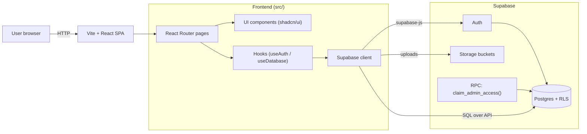

# Purna Travels Hub

Purna Travels Hub is a React + Vite travel website with a Supabase-backed admin panel. Admin users can manage destinations, tour packages, package media, blog posts, blog images/videos, and customer enquiries from the dashboard.

## Live Demo

- [Live Link](https://www.purnatourandtravel.com/)

## Tech Stack

- React 18
- TypeScript
- Vite
- Tailwind CSS
- shadcn/ui
- Supabase Auth, Database, and Storage

## Features

- Public pages for destinations, packages, package details, blog listing, and blog posts
- User signup, login, and personal account area
- Admin login protected by Supabase auth and role-based access
- Admin signup with bootstrap access code
- Destination management from the admin panel
- Package CRUD with image and video uploads
- Blog CRUD with cover image upload and additional image/video attachments
- Enquiry capture stored in Supabase

## Architecture

### High-level diagram



### Key pieces

- Routing: `src/App.tsx` maps public pages + `/admin/*` dashboard routes.
- Auth + roles: `src/hooks/useAuth.tsx` uses Supabase Auth and checks `public.user_roles` for `admin`.
- Data access: `src/hooks/useDatabase.ts` reads packages/destinations/blog/enquiries via `supabase.from(...)`.
- Database + RLS: SQL migrations in `supabase/migrations` create tables, policies, triggers, and the `claim_admin_access` RPC.

## Local Development

### 1) Install

```sh
npm install
npm run dev
```

### 2) Environment variables

Create a local `.env` file from the template:

```sh
# macOS/Linux
cp .env.example .env

# Windows (PowerShell)
Copy-Item .env.example .env
```

Fill in:

- `VITE_SUPABASE_URL`
- `VITE_SUPABASE_PUBLISHABLE_KEY` (Supabase publishable/anon key)

Do not commit `.env` (it is gitignored).

## Database Setup

Create a Supabase project, then apply the SQL migrations inside `supabase/migrations` to create:

- `user_roles`
- `profiles`
- `admin_signup_codes`
- `destinations`
- `packages`
- `package_media`
- `blog_posts`
- `blog_media`
- `enquiries`
- storage buckets for package and blog media

### Admin access

- The migration seeds a bootstrap admin signup code as `CHANGE_ME_ADMIN_SIGNUP_CODE`.
- Before going live, change it (either edit the migration before applying, or update the row in `public.admin_signup_codes`).

After the first admin account is created, you can deactivate the code by setting `active = false`.

## Admin Areas

- `/admin`
- `/auth`
- `/account`
- `/admin/destinations`
- `/admin/packages`
- `/admin/blog`
- `/admin/enquiries`

## Notes

- Packages and blog posts now read from Supabase instead of bundled sample content.
- Destination pages are also database-driven.
- Signed-in users can submit enquiries that are linked to their account.
- Replace placeholder images in storage or destination records with your own branded assets as needed.

## Production build

```sh
npm run build
npm run preview
```
